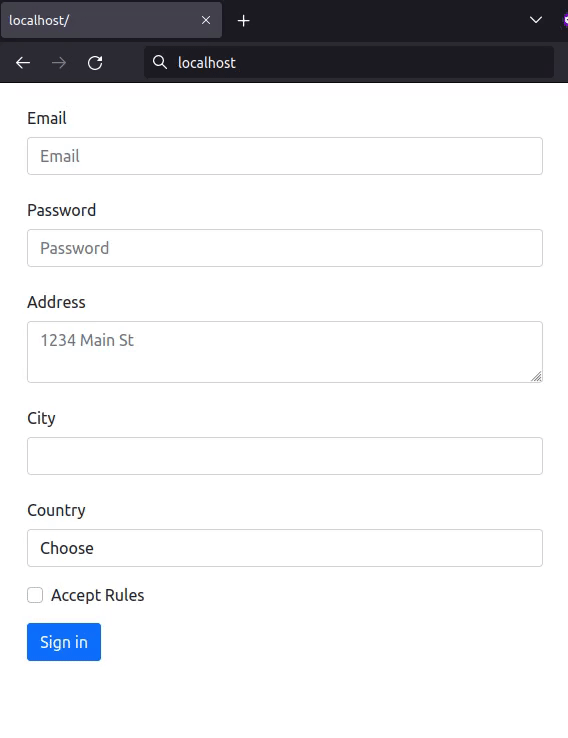

# Формы

Реализуйте компонент `<MyForm>`, отображающий форму из шести элементов:

- `email` – инпут типа `email`
- `password` – инпут типа `password`
- `address` – `textarea`
- `city` – текстовый инпут
- `country` – `select` со следующими значениями: argentina, russia, china
- `Accept Rules` – `checkbox`, булево значение должно быть приведено к строке

После сабмита формы появляется таблица, в которой показываются значения всех полей. Из этой формы можно вернуться в редактирование по кнопке _Back_. При этом все данные должны оказаться на своих местах.



Форма:

```html
<form name="myForm">
  <div class="col-md-6 mb-3">
    <label for="email" class="col-form-label">Email</label>
    <input
      type="email"
      name="email"
      class="form-control"
      id="email"
      placeholder="Email"
    />
  </div>
  <div class="col-md-6 mb-3">
    <label for="password" class="col-form-label">Password</label>
    <input
      type="password"
      name="password"
      class="form-control"
      id="password"
      placeholder="Password"
    />
  </div>
  <div class="col-md-6 mb-3">
    <label for="address" class="col-form-label">Address</label>
    <textarea
      type="text"
      class="form-control"
      name="address"
      id="address"
      placeholder="1234 Main St"
    ></textarea>
  </div>
  <div class="col-md-6 mb-3">
    <label for="city" class="col-form-label">City</label>
    <input type="text" class="form-control" name="city" id="city" />
  </div>
  <div class="col-md-6 mb-3">
    <label for="country" class="col-form-label">Country</label>
    <select id="country" name="country" class="form-control">
      <option value="">Choose</option>
      <option value="argentina">Argentina</option>
      <option value="russia">Russia</option>
      <option value="china">China</option>
    </select>
  </div>
  <div class="col-md-6 mb-3">
    <div class="form-check">
      <label class="form-check-label" for="rules">
        <input
          id="rules"
          type="checkbox"
          name="acceptRules"
          class="form-check-input"
        />
        Accept Rules
      </label>
    </div>
  </div>
  <button type="submit" class="btn btn-primary">Sign in</button>
</form>
```

Пример таблицы после отправки формы:

```html
<div>
  <button type="button" class="btn btn-primary">Back</button>
  <table class="table">
    <tbody>
      <tr>
        <td>acceptRules</td>
        <td>true</td>
      </tr>
      <tr>
        <td>address</td>
        <td>lenina street</td>
      </tr>
      <tr>
        <td>city</td>
        <td>moscow</td>
      </tr>
      <tr>
        <td>country</td>
        <td>russia</td>
      </tr>
      <tr>
        <td>email</td>
        <td>my@email.com</td>
      </tr>
      <tr>
        <td>password</td>
        <td>qwerty</td>
      </tr>
    </tbody>
  </table>
</div>
```

Строки сортируются в алфавитном порядке по именам в первом столбце. В вашем случае результирующая таблица может отличаться, все зависит от того, какие данные выбраны, но названия полей должны быть как указано в примере.

## Подсказки

- [Forms](https://getbootstrap.com/docs/5.1/forms/overview/)
- Тесты сами заполняют форму. Если какие-то поля не заполнены, в таблице выводятся пустые значения для этих полей.
