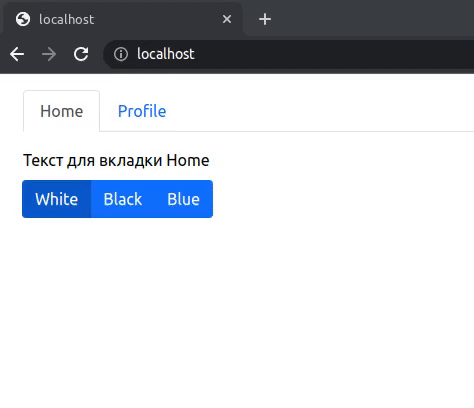

# Контекст (Context API)

В этом задании вам предстоит реализовать вкладки (табы) и переключатель тем для контента внутри вкладок:



## src/App.jsx

Ознакомьтесь со списком тем. Каждая тема включает в себя класс стилей, который должен присваиваться контенту при переключении темы. Сделайте сохранение выбранной темы в состоянии компонента, по умолчанию выбрана первая тема. Добавьте провайдер для передачи данных контекста. Данные должны содержать всё необходимое для работы: список тем, текущую выбранную тему, метод для изменения темы.

Реализуйте переключатель вкладок. Можно использовать готовый компонент [Tabs](https://react-bootstrap.github.io/docs/components/tabs/) из `react-bootstrap`.

Пример использования:

```jsx
render() {
  return (
    <Tabs>
      <Tab eventKey="login" title="Login">
        <Home />
      </Tab>
      <Tab eventKey="registration" title="Registration">
        <Profile />
      </Tab>
    </Tabs>
  );
}
```

## src/Home.jsx и src/Profile.jsx

В компонентах `src/Home.jsx` и `src/Profile.jsx` добавьте получение необходимых данных из контекста. Выведите текст из константы `content`. Элемент контента должен содержать класс выбранной темы.

Пример контента внутри вкладки:

```html
<article class="light">Текст для вкладки Home</article>
```

## src/ThemeSwitcher.jsx

Добавьте получение необходимых данных из контекста и реализуйте переключение темы. Переключение тем должно срабатывать для всех вкладок. Можно использовать готовые компоненты [ToggleButton](https://react-bootstrap.github.io/docs/components/buttons/#togglebuttongroup) и [ButtonGroup](https://react-bootstrap.github.io/docs/components/button-group/) из `react-bootstrap`.

Пример использования:

```js
render() {
  return (
    <ButtonGroup className="mb-2">
      <ToggleButton
        id="toggle-check"
        type="checkbox"
        variant="secondary"
        checked={checked}
        value="1"
        onChange={(e) => setChecked(e.currentTarget.checked)}
      >
        Checked
      </ToggleButton>
    </ButtonGroup>
  );
}
```
