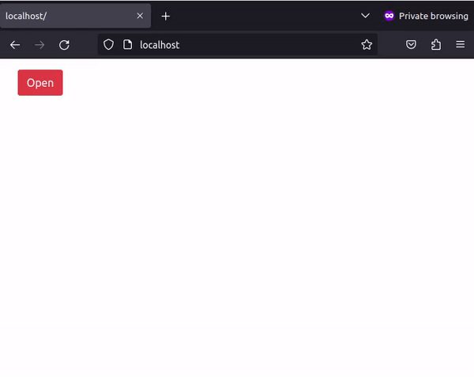

# Virtual Dom

## src/Modal.jsx

Реализуйте компонент `<Modal>` (модальное окно).



Использование:

```js
export default class Component extends React.Component {
  state = { modal: false };

  toggle = (e) => {
    this.setState({
      modal: !this.state.modal,
    });
  };

  render() {
    return (
      <div>
        <button
          type="button"
          className="modal-open-button btn btn-danger"
          onClick={this.toggle}
        >
          Open
        </button>
        <Modal isOpen={this.state.modal}>
          <Modal.Header toggle={this.toggle}>Modal title</Modal.Header>
          <Modal.Body>
            Lorem ipsum dolor sit amet, consectetur adipisicing elit
          </Modal.Body>
          <Modal.Footer>
            <button
              type="button"
              className="modal-close-button btn btn-secondary"
              onClick={this.toggle}
            >
              Cancel
            </button>
          </Modal.Footer>
        </Modal>
      </div>
    );
  }
}
```

HTML закрытого состояния:

```html
<div>
  <button type="button" class="modal-open-button btn btn-danger">Open</button>
  <div class="modal" style="display: none;" role="dialog">
    <div class="modal-dialog">
      <div class="modal-content">
        <div class="modal-header">
          <div class="modal-title">Modal title</div>
          <button
            type="button"
            class="btn-close"
            data-bs-dismiss="modal"
            aria-label="Close"
          ></button>
        </div>
        <div class="modal-body">
          Lorem ipsum dolor sit amet, consectetur adipisicing elit
        </div>
        <div class="modal-footer">
          <button type="button" class="modal-close-button btn btn-default">
            Cancel
          </button>
        </div>
      </div>
    </div>
  </div>
</div>
```

В открытом состоянии строчка `<div class="modal" style="display: none;"> ` заменяется на `<div class="modal fade show" style="display: block;">`

У открытого модального окна две кнопки закрывающие его: крестик справа вверху и кнопка `Cancel` справа внизу.

## Подсказки

- [Modal](https://getbootstrap.com/docs/5.1/components/modal/)
