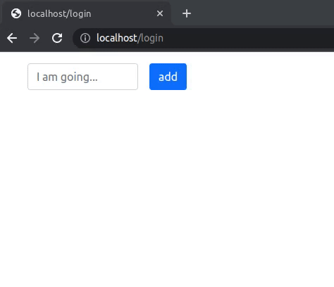

# Жизненный цикл компонентаs

В этом упражнении необходимо реализовать записную книжку, которая взаимодействует с бэкендом по следующим URL-адресам:

- `GET /api/tasks` — получить список задач.

  Формат ответа — `[{"id":"1","text":"first task","state":"finished"},{"id":"2","text":"second task","state":"active"}]`

- `POST /api/tasks` — создать новую задачу.

  Формат запроса — `{"text": "another task"}`

  Формат ответа — `{"id":"3","text":"another task","state":"active"}`

- `PATCH /api/tasks/:id/finish` — завершить задачу.

  Формат ответа — `{"id":"1","text":"first task","state":"finished"}`

- `PATCH /api/tasks/:id/activate` — переоткрыть завершенную задачу — `{"id":"1","text":"first task","state":"active"}`



Начальный HTML ниже. При первой загрузке на сервере задач нет(`GET /api/tasks` возвращает пустой массив):

```html
<div>
  <div class="mb-3">
    <form class="todo-form mx-3">
      <div class="d-flex col-md-3">
        <input
          type="text"
          value=""
          required=""
          class="form-control me-3"
          placeholder="I am going..."
        />
        <button type="submit" class="btn btn-primary">add</button>
      </div>
    </form>
  </div>
</div>
```

HTML после того, как добавлены последовательно три задачи first task, second task и another task:

```html
<div>
  <div class="mb-3">
    <form class="todo-form mx-3">
      <div class="d-flex col-md-3">
        <input
          type="text"
          value=""
          required=""
          class="form-control me-3"
          placeholder="I am going..."
        />
        <button type="submit" class="btn btn-primary">add</button>
      </div>
    </form>
  </div>
  <div class="todo-active-tasks">
    <div class="row">
      <div class="col-1">3</div>
      <div class="col">
        <a href="#" class="todo-task">another task</a>
      </div>
    </div>
    <div class="row">
      <div class="col-1">2</div>
      <div class="col">
        <a href="#" class="todo-task">second task</a>
      </div>
    </div>
    <div class="row">
      <div class="col-1">1</div>
      <div class="col">
        <a href="#" class="todo-task">first task</a>
      </div>
    </div>
  </div>
</div>
```

На последнюю добавленную задачу был совершен клик, который перевел задачу в выполненные:

```html
<div>
  <div class="mb-3">
    <form class="todo-form mx-3">
      <div class="d-flex col-md-3">
        <input
          type="text"
          value=""
          required=""
          class="form-control me-3"
          placeholder="I am going..."
        />
        <button type="submit" class="btn btn-primary">add</button>
      </div>
    </form>
  </div>
  <div class="todo-active-tasks">
    <div class="row">
      <div class="col-1">2</div>
      <div class="col">
        <a href="#" class="todo-task">second task</a>
      </div>
    </div>
    <div class="row">
      <div class="col-1">1</div>
      <div class="col">
        <a href="#" class="todo-task">first task</a>
      </div>
    </div>
  </div>
  <div class="todo-finished-tasks">
    <div class="row">
      <div class="col-1">3</div>
      <div class="col">
        <s><a href="#" class="todo-task">another task</a></s>
      </div>
    </div>
  </div>
</div>
```

После клика по задаче second task:

```html
<div>
  <div class="mb-3">
    <form class="todo-form mx-3">
      <div class="d-flex col-md-3">
        <input
          type="text"
          value=""
          required=""
          class="form-control me-3"
          placeholder="I am going..."
        />
        <button type="submit" class="btn btn-primary">add</button>
      </div>
    </form>
  </div>
  <div class="todo-active-tasks">
    <div class="row">
      <div class="col-1">1</div>
      <div class="col">
        <a href="#" class="todo-task">first task</a>
      </div>
    </div>
  </div>
  <div class="todo-finished-tasks">
    <div class="row">
      <div class="col-1">3</div>
      <div class="col">
        <s><a href="#" class="todo-task">another task</a></s>
      </div>
    </div>
    <div class="row">
      <div class="col-1">2</div>
      <div class="col">
        <s><a href="#" class="todo-task">second task</a></s>
      </div>
    </div>
  </div>
</div>
```

## src/TodoBox.jsx

Реализуйте компонент `<TodoBox>`.

Первоначальная подгрузка задач с сервера должна происходить сразу после монтирования компонента в DOM.

Список выполненных задач должен идти после списка активных задач, при этом задачи в каждом списке должны идти в том порядке, в котором они добавлялись (сверху – последняя)

## src/Item.jsx

Реализуйте компонент `<Item>`, отвечающий за вывод конкретной записи.

Выполненная задача должна быть обёрнута в тэг `<s>`,чтобы элемент отображался как перечеркнутый

## Подсказки

- Для генерации URL-адресом в файле routes.js созданы специальные хелперы.
- Для изменения состояния используйте [immutability-helper](https://github.com/kolodny/immutability-helper#examples).
- Изменение объекта в массиве: `update([{ hello: 'world' }], { 0: { $merge: { hello: 'kitty' } } })`
  После выполнения запроса на добавление элемента нет необходимости заново получать весь список повторным GET-запросом. Тесты проверяют, что нет лишних запросов.
